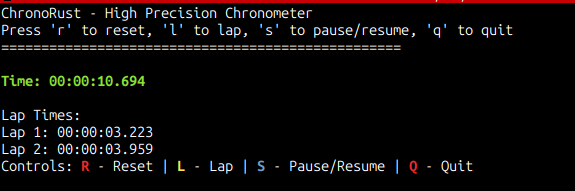

# ChronoRust

A high-precision chronometer for Linux terminal built with Rust. This application provides millisecond-level timing accuracy and supports up to 99 hours of measurement.



## Features

- **High Precision**: Millisecond accuracy (3 decimal places)
- **Long Duration Support**: Up to 99 hours of timing
- **Real-time Display**: Live updating chronometer display
- **Lap Times**: Record multiple lap times during a session
- **Pause/Resume**: Stop and continue timing with state preservation
- **Terminal UI**: Clean, colorful terminal interface
- **Keyboard Controls**: Simple key-based controls
- **Cross-platform**: Works on Linux, Windows, and macOS
- **Docker Support**: Containerized deployment
- **Logging Support**: Optional session logging with `-C` parameter
- **Lap Time Analysis**: Shows time differences between consecutive laps

## Installation

### Prerequisites

- Rust (latest stable version)
- Linux terminal

### Build from Source

```bash
git clone https://github.com/stulluk/chronorust.git
cd chronorust
cargo build --release
```

### Run

```bash
cargo run
```

Or run the release binary:

```bash
./target/release/chronorust
```

### Static Build (Portable)

For a completely portable binary that works on any Linux system:

```bash
# Install musl tools
sudo apt install musl-tools

# Build static binary
cargo build --release --target x86_64-unknown-linux-musl

# Run static binary
./target/x86_64-unknown-linux-musl/release/chronorust
```

The static binary is only ~1.1MB and requires no dependencies!

### Logging Feature

ChronoRust supports optional session logging:

```bash
# Run with logging enabled
cargo run -- -C
```

This creates a log file named `ChronoRust-DD-MM-YY-HH-MM-SS-log.txt` in the current directory with session information, lap times, and events.

## Usage

### Controls

- **L** - Record lap time
- **R** - Reset chronometer and restart
- **S** - Pause/Resume chronometer
- **Q** - Quit application

### Display Format

- **Time Format**: `HH:MM:SS.mmm` (always shows hours, even if zero)
- **Lap Times**: Numbered list of recorded lap times with time differences
- **Lap Differences**: Shows `(Δ: HH:MM:SS.mmm)` between consecutive laps

### Example Session

1. Start the application: `cargo run`
2. Chronometer starts automatically
3. Press **L** to record lap times
4. Press **S** to pause/resume
5. Press **R** to reset and restart
6. Press **Q** to quit

## Technical Details

- **Language**: Rust
- **Dependencies**: 
  - `ratatui` - Terminal UI framework
  - `crossterm` - Cross-platform terminal manipulation
  - `chrono` - Date and time handling
- **Precision**: Millisecond-level timing using `std::time::Instant`
- **Maximum Duration**: 99 hours (3,564,000,000 milliseconds)

## Docker Support

### Using Docker

```bash
# Build Docker image
docker build -t chronorust .

# Run with Docker
docker run -it --rm chronorust

# Using docker-compose
docker-compose up
```

### Docker Features

- Multi-stage build for optimized image size
- Non-root user for security
- Minimal runtime dependencies
- Cross-platform support

## GitHub Actions

This project includes automated CI/CD pipeline:

- **Testing**: Automated testing on push/PR
- **Code Quality**: Clippy linting and formatting checks
- **Cross-platform Builds**: Linux, Windows, macOS
- **Release Automation**: Automatic binary releases
- **Docker Builds**: Automated Docker image builds

## Development

### Project Structure

```
chronorust/
├── .github/
│   └── workflows/
│       └── ci.yml          # GitHub Actions workflow
├── src/
│   └── main.rs            # Main application code
├── Cargo.toml             # Project configuration
├── Dockerfile             # Docker configuration
├── docker-compose.yml     # Docker Compose configuration
├── .gitignore             # Git ignore rules
└── README.md              # This file
```

### Building

```bash
# Debug build
cargo build

# Release build
cargo build --release

# Run tests
cargo test

# Check code
cargo check

# Format code
cargo fmt

# Lint code
cargo clippy
```

## License

This project is licensed under the MIT License - see the LICENSE file for details.

## Contributing

1. Fork the repository
2. Create a feature branch (`git checkout -b feature/amazing-feature`)
3. Commit your changes (`git commit -m 'Add some amazing feature'`)
4. Push to the branch (`git push origin feature/amazing-feature`)
5. Open a Pull Request

## Roadmap

- [ ] Save/load lap times to file
- [ ] Multiple chronometer sessions
- [ ] Sound alerts for lap times
- [ ] Export lap times to CSV
- [ ] Customizable display themes
- [ ] Split times functionality

## Screenshots

```
ChronoRust - High Precision Chronometer
Press 'r' to reset, 'l' to lap, 's' to pause/resume, 'q' to quit
==================================================
Time: 00:01.309
Lap Times:
Controls: R - Reset | L - Lap | S - Pause/Resume | Q - Quit
```

**Real Terminal Output**: The chronometer displays time in `HH:MM:SS.mmm` format with live updates. The interface shows the current time, lap times (when recorded), and control instructions at the bottom.

## Quick Start

### From Source
```bash
git clone https://github.com/stulluk/chronorust.git
cd chronorust
cargo run
```

### With Docker
```bash
git clone https://github.com/stulluk/chronorust.git
cd chronorust
docker-compose up
```

### Download Release
Visit the [Releases](https://github.com/stulluk/chronorust/releases) page to download pre-built binaries for your platform.

### Pre-built Binaries
- **Linux**: `chronorust-linux-x86_64-static` (portable static binary)
- **Windows**: `chronorust-windows-x86_64.exe`
- **macOS**: `chronorust-macos-x86_64`
